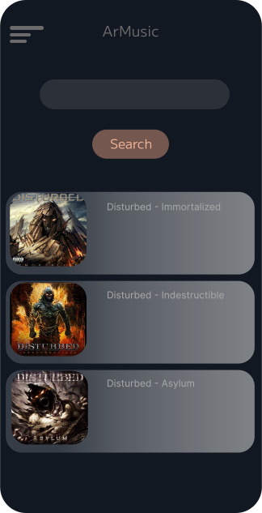
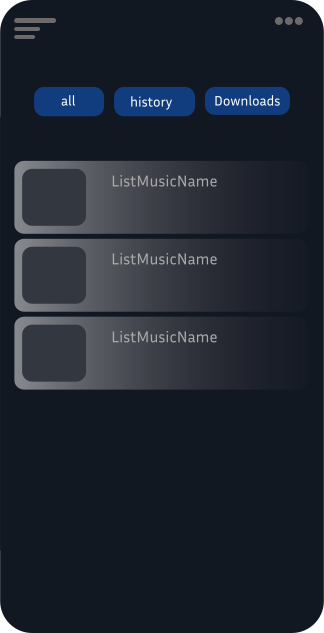

# 🎵 ARMusic

Aplicación de música para Android construida con **Jetpack Compose**, enfocada en una arquitectura modular y en la experimentación con obtención de contenido multimedia mediante **yt-dlp**.

> ⚠️ **Proyecto en construcción (Work in Progress)** — actualmente en desarrollo activo.

---

## 📱 Acerca del proyecto

**ARMusic** es una aplicación Android creada para explorar prácticas modernas de desarrollo mientras se construye un reproductor musical funcional.

El proyecto experimenta con:

* UI moderna usando Jetpack Compose
* Inyección de dependencias
* Persistencia local
* Extracción multimedia mediante scraping
* Arquitectura por capas inspirada en Clean Architecture

El objetivo principal es **aprendizaje y experimentación arquitectónica**.

---

## ✨ Funcionalidades (Actuales y Planeadas)

* 🎧 Reproducción de música
* 🔎 Obtención de contenido usando scraping con yt-dlp
* 🧩 Arquitectura modular
* 💉 Inyección de dependencias con Hilt
* 🗄️ Persistencia local con Room + SQL
* ⚡ UI reactiva con Compose

---

## 🖼️ Capturas de Pantalla


### Pantalla Principal



### Reproductor


### Listas guardadas


---

## 🧱 Arquitectura

El proyecto sigue una **arquitectura por capas inspirada en Clean Architecture**.

``
ui → domain ← data
        ↑
        di
```

* **ui/** → interfaz y ViewModels
* **domain/** → lógica de negocio y contratos
* **data/** → implementaciones concretas
* **di/** → configuración de Hilt

---

## 🛠️ Tecnologías utilizadas

* Kotlin
* Jetpack Compose
* Hilt (Dependency Injection)
* Room Database
* SQL
* Retrofit
* yt-dlp (scraping)
* Coroutines & Flow

---

## ⚠️ Disclaimer

Este proyecto tiene fines educativos y experimentales.

La extracción multimedia depende de servicios externos y puede dejar de funcionar si estos cambian.

---

## 🚀 Cómo ejecutar

```
git clone https://github.com/Franszh/ArMusic.git
```

1. Abrir en Android Studio
2. Sincronizar Gradle
3. Ejecutar en emulador o dispositivo

---

## 🎯 Objetivos de aprendizaje

* Aplicar conceptos de Clean Architecture en Android
* Practicar inyección de dependencias con Hilt
* Explorar fuentes multimedia mediante scraping
* Construir UI reactiva con Compose

---

## 👨‍💻 Autor

FranSzh


